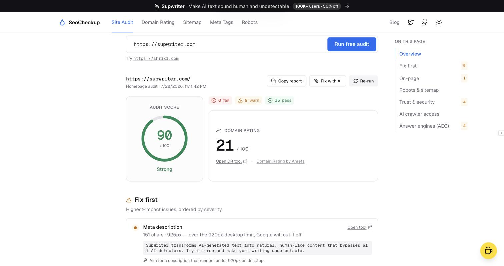

## SeoCheckup — free technical SEO, AI crawler and answer-engine audit

Paste any URL — a homepage or a deep page — for 43 checks across on-page signals, crawl access, security, AI crawler access, and how citable you are to answer engines. No account, nothing paywalled.

---

## Tools

| Tool | What it does |
| --- | --- |
| **Site Audit** | 43 checks in five scored categories. Titles and descriptions are measured in rendered pixels, not characters, because that is what Google truncates on. |
| **Robots.txt Viewer** | RFC 9309 URL tester that shows the winning rule, plus a crawler access matrix split by training / search / assistant purpose. |
| **Sitemap Checker** | Paste a bare domain and it finds the sitemap from robots.txt or the usual paths, expands nested indexes, and validates `lastmod`, `changefreq` and `priority`. |
| **Meta Tags Checker** | Full tag inventory, pixel-width snippet gauges, `og:image` validation, and six social previews. |
| **Domain Rating** | Ahrefs Domain Rating for one domain, or up to five side by side. |

### Answer engine (AEO) checks

The audit includes a dedicated category for how usable your page is to ChatGPT, Claude and Perplexity:

- **Markdown twin** — whether the page also serves clean Markdown at `/path.md`, `/index.md`, or via `Accept: text/markdown` content negotiation. Answer engines parse Markdown far more reliably than HTML and it costs 60–80% fewer tokens to read.
- **llms.txt / llms-full.txt / ai.txt** discovery
- **Content readable without JavaScript** — most answer engines do not execute JS, so anything rendered client-side is invisible to them
- Answer-ready schema, question-shaped headings, linkable section anchors, freshness and author signals

`robots.txt` parsing also understands Cloudflare's `Content-Signal:` directive, so a declared `search` / `ai-input` / `ai-train` policy is surfaced rather than flagged as unknown.

---

## TECH STACK

- Stack : `NextJS`
- UI : `TailwindCSS and ShadcnUI`
- Icons : `Lucide`
- Motion : `Framer Motion`
- Hosting : `Vercel`

---

## Setup

1. Fork and Clone the repo
2. If you don't have pnpm run `npm install -g pnpm`
3. run `pnpm install`
4. Copy env template: `cp .env.example .env.local` and fill in values (see below)
5. run `pnpm run dev`
6. Create a new branch, make code changes, open a PR (contributions welcome)

## Environment variables

See [`.env.example`](.env.example).

| Variable | Required | Purpose |
| --- | --- | --- |
| `UPSTASH_REDIS_REST_URL` | Production | Rate limiting (`/api/v1`, `/api/sitemap`, `/api/audit`, `/api/domain-rating`) |
| `UPSTASH_REDIS_REST_TOKEN` | Production | Rate limiting |
| `DISCORD_LOGS_ID` | Recommended | Discord webhook ID (server-only usage logs) |
| `DISCORD_LOGS_TOKEN` | Recommended | Discord webhook token |

If the Upstash variables are unset, rate limiting is disabled and the tools still run — so a fresh clone works locally without an account. Set them before deploying.

Ahrefs Domain Rating needs **no** API key (public free endpoint).

---
