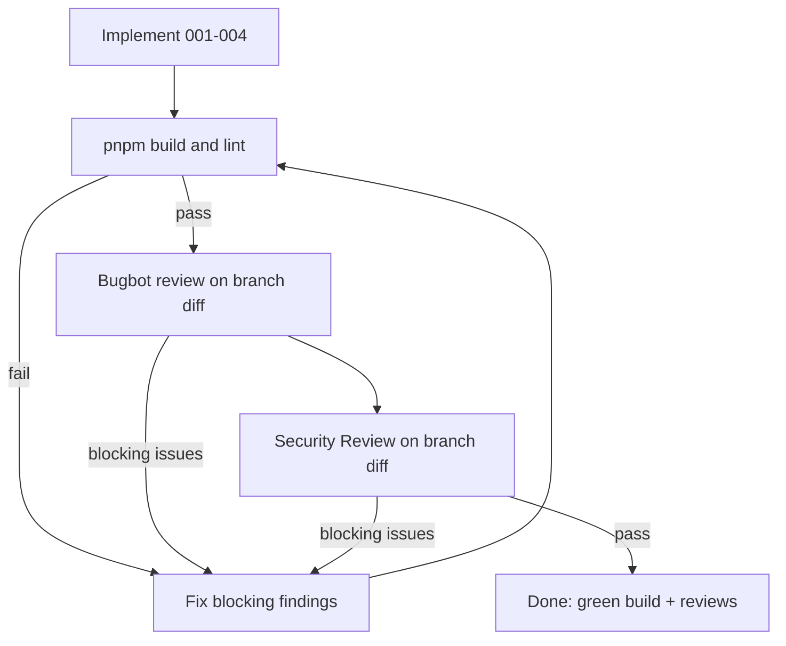

# 005 — Review → fix loop until green

**Commit stamped:** `f80b491`  
**Depends on:** 001–004 implemented on a feature branch  
**Status:** PENDING

## Goal

Close the loop the user requested: **code → multi-agent review → fix → re-review** until build passes and reviews are clean enough to ship.

## Loop (repeat until exit criteria)



### Step 1 — Verification gate

```bash
pnpm install
pnpm build
pnpm lint
```

Fix compile/lint failures before any review dispatch.

### Step 2 — Manual smoke (implementer)

- `/` — brand hero, 3 tool cards, theme toggle, reduced-motion sanity
- `/sitemap?q=…` — load, count, copy, tree
- `/metadata?q=…` — title/description/og preview
- `/robots?q=…` — robots text render
- Rate limit path optional (do not burn production Redis unnecessarily)

### Step 3 — Bugbot review

Dispatch Bugbot (readonly) on **branch changes** with change description summarizing 001–004. Collect blocking bugs only for the fix queue; polish nits can be batched if cheap.

### Step 4 — Security review

Dispatch Security Review (readonly) on **branch changes**. Prioritize:

- SSRF / open proxy via `/api/v1` (URL allow/deny considerations — document residual risk if intentional product behavior)
- `NEXT_PUBLIC_` Discord credentials in [`lib/discord-webhook.ts`](../lib/discord-webhook.ts)
- Rate-limit bypass / header spoofing (`x-forwarded-for`)
- XSS from rendering fetched HTML/XML/robots text (ensure text not `dangerouslySetInnerHTML` unless sanitized)

Implement fixes for HIGH/MEDIUM blockers; LOW can be noted in plan index as follow-ups.

### Step 5 — Fix and re-run

Any blocking finding → patch → back to Step 1. Cap at **3 full loops** unless user extends; if still blocked, stop with a clear residual-risk report.

## Exit criteria

- `pnpm build` and `pnpm lint` exit 0
- Bugbot: no unresolved blocking issues from the latest pass
- Security: no unresolved HIGH issues; MEDIUM either fixed or explicitly accepted in `plans/README.md`
- No `yarn.lock` / `package-lock.json`
- Product sitemap URLs all valid absolute paths

## Out of scope

- Pushing/merging without user request
- Full new test framework (optional tiny smoke script only if needed for a review finding)
